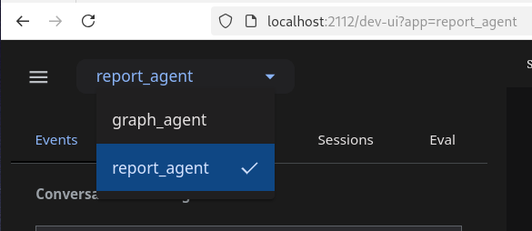
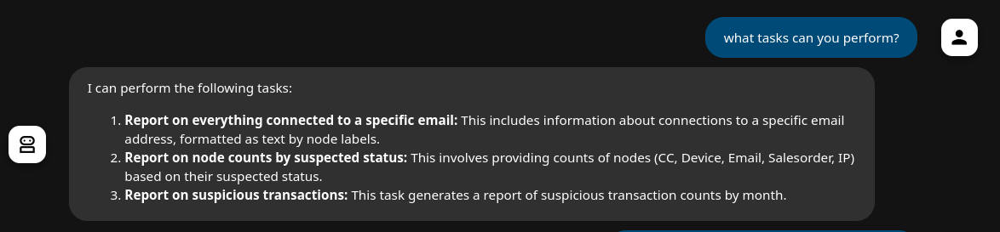
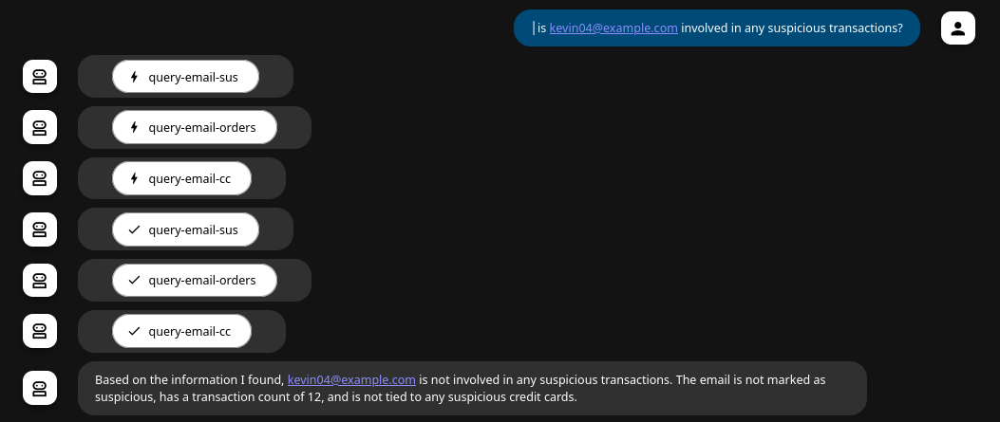

# Let's build an agent that asks graph questions

This utilizes ADK and MCP Toolbox

## Setup Gcloud 

```bash
gcloud auth application-default login
```

## Create the ENV file

```bash
cp env.sample .env
# edit the file
cp .env graph_agent/.env
source .env
```

## Get Python setup and load the Data

```bash
python3 -m venv .venv
source .venv/bin/activate
pip install -r requirements.txt
```

## Download the Toolbox

```bash
# If on linux
make getmcplinux

# If on Mac
make getmcpmac
```

## Start the Toolbox

```bash
make runtoolbox
```
## Start the Agent Kit

```bash
adk web
```

Select either the report_agent or graph agent


## Ask some questions

```
What can you do?
```

```
is kevin04@example.com involved in any suspicious transactions?
```


```
get me all information for the email jenniferhampton@example.org
```
