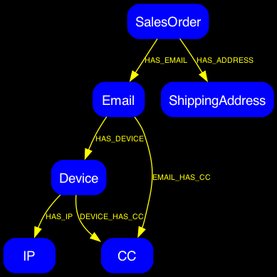

# User Identity Graph

Let's build an Identity graph that connects various aspects of customers for our retail website.

Spotting order shapes such as Devices, Credit Cards and Shipping Addresses help to establish legitimate usage patterns.

Finding shared data across identities also allows providers to customize offers and provide better recommendations. 

This demo also includes a Chatbot powered by [Agent Development Kit](https://google.github.io/adk-docs/) and [GenAI Toolbox](https://github.com/googleapis/genai-toolbox)

## Sample Data



## Setup Gcloud 

```bash
gcloud auth application-default login
make instancecreate
make loadschema
```


## Get Python setup and load the Data

```bash
python3 -m venv .venv
source .venv/bin/activate
pip install -r requirements.txt
./load_data.py
```

## Start Querying

[Queries](./SampleQueries.md)

## Run the Agent Space chat Agent to query this data 

[Agent Set Up and Execution](./GraphAgent/README.md)

## Benchmarking

There are some sample Benchmarking scripts that give an idea of latency of various usage scenarios

```bash
cd ./snippets
```


### 2 Hop Parameterized Queries

Run through 1000 parameterized 2 hop queries to understand basic latency

```bash
./parameterize.py
admin_@cloudshell:~/SpannerUserIdentityGraph/snippets$ ./parameterize.py 
Finding bad actors |████████████████████████████████████████| 1000/1000 [100%] in 6.2s (162.45/s) 

Database Query Time Statistics:
Mean: 6.091185 ms
p95 : 4.771419 ms
p99 : 4.771489 ms

Found 87 bad actors
```

### Get Order Shapes

Grab 1000 sample transactions and they run a query shape on each of those with the Email, Address and CC id's to see if we see similar transaction shapes

```bash
./get_order_shapes.py
admin_@cloudshell:~/SpannerUserIdentityGraph/snippets $ ./get_order_shapes.py 
Getting a list of shapes
Finding similar shapes |████████████████████████████████████████| 1000/1000 [100%] in 5.5s (181.70/s) 

Database Query Time Statistics:
Mean: 5.442143 ms
p95 : 4.238226 ms
p99 : 4.240366 ms
```
